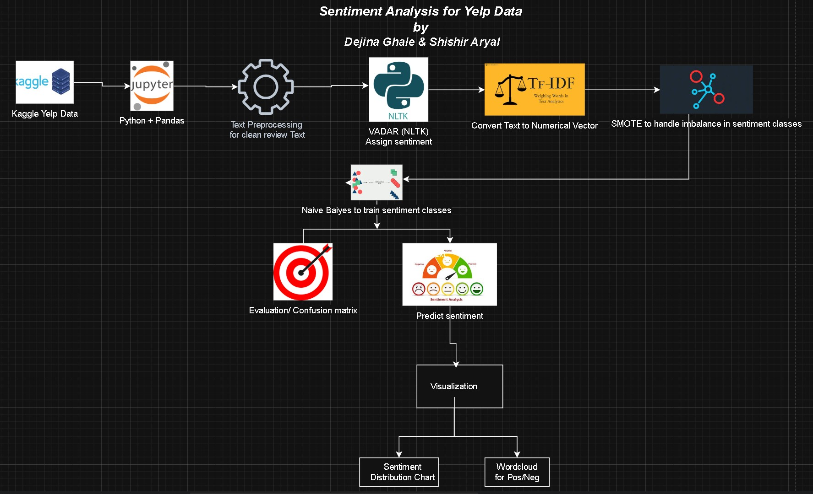

# Sentiment Analysis on Yelp Reviews

This project performs sentiment analysis on Yelp reviews using Python and Jupyter Notebook. The goal is to classify reviews into **positive**, **neutral**, or **negative** sentiments.

## 👥 Team Members
- Shishir Aryal
- Dejina Ghale

##  Project Overview
This project aims to extract sentiment polarity from real Yelp customer reviews. Using the VADER sentiment analyzer along with TF-IDF vectorization and a Naive Bayes classifier, we built a complete machine learning pipeline. Class imbalance was handled using SMOTE. The final model was evaluated using accuracy scores, confusion matrix, and word cloud visualizations.

## Technologies & Tools
- Python (Jupyter Notebook)
- NLTK (VADER)
- Scikit-learn
- Imblearn (SMOTE)
- Matplotlib & Seaborn
- WordCloud

## Architecture

## Visual Outputs
- Sentiment distribution charts
- Confusion matrix
- WordClouds for positive and negative sentiments

## How to Run
1. Clone the repo
2. Open `Final Sentiment Analysis.ipynb` in Jupyter Notebook
3. Run each cell sequentially

## 📎 License
MIT License
